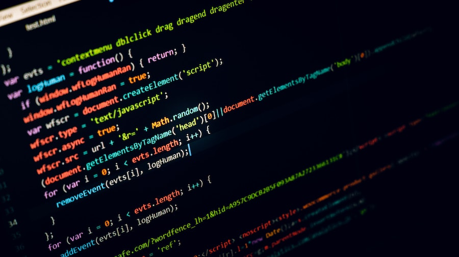

# Tech-Basics-1

Welcome! 👋  
This is the **first project** in the *Tech Basics 1* seminar from my university.

## 📚 Weekly Exercises

You can find the exercises for each week inside the corresponding folder...
Each folder contains the assignments and solutions for that specific week.

## 🐍 Learning Python

These exercises aim to teach the basics of **Python programming** – along with many hopefully useful and practical skills for working with code.

By the end of the seminar, we'll have built a strong foundation in Python and optimistically be more confident in writing and understanding code.

